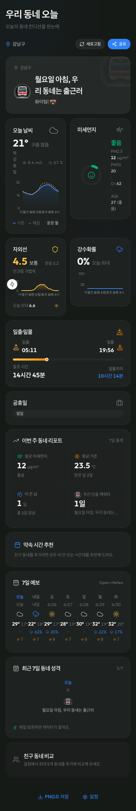

# 우리 동네 오늘 (Our Neighborhood Today)

> 내 동네의 오늘을 12가지 데이터로 한눈에 — 친구 동네랑 비교까지.
> 서버 비용 0원, API 키 0개, 다크모드 기본.

<div align="center">

### 🚀 **[Launch Live Demo →](https://dongne-today.vercel.app/)**

[](https://dongne-today.vercel.app/)

**모바일/데스크탑 모두 지원 · 별도 설치 없이 브라우저에서 바로 · 다크모드 기본**

</div>

---




---

## 🇰🇷 한국어

### 💡 한 줄 컨셉

**"지금 우리 동네 공기·날씨·행사·친구 동네까지 — 한 화면에서 끝."**

> 🚀 **[라이브 데모 보기 → dongne-today.vercel.app](https://dongne-today.vercel.app/)**
> 모바일/데스크탑 모두 지원, 별도 설치 없이 바로 사용.

미세먼지·강수·자외선·일출·일몰·공휴일까지 **12가지 데이터**를 인포그래픽 대시보드로 보여주고, 동네의 분위기는 **MBTI 캐릭터 한 줄 리포트**로 표현합니다. 친구 동네를 최대 5곳까지 등록해 가로 막대 비교도 가능.

### ✨ 핵심 기능

| # | 기능 | 시각화 | 데이터 소스 |
|---|---|---|---|
| 1 | 🌤️ **오늘 날씨** (24시간 hourly) | 라인 차트 | Open-Meteo |
| 2 | 🌫️ **미세먼지 PM2.5/PM10** | 라디얼 게이지 + 표정 아이콘 | Open-Meteo Air Quality |
| 3 | ☔ **강수확률/강수량** (24시간 hourly) | 영역 차트 | Open-Meteo |
| 4 | ☀️ **자외선 지수** | 라인 + 등급 | Open-Meteo |
| 5 | 🌅 **일출/일몰/일조 시간** | 진행 막대 | Open-Meteo |
| 6 | 🎭 **공휴일 여부 + D-N** | 배지 | Nager Date |
| 7 | 📊 **이번 주 동네 리포트** | 4-타일 통계 | localStorage 캐릭터 히스토리 |
| 8 | 📅 **7일 예보** | 일별 아이콘 + 강수확률 | Open-Meteo |
| 9 | 🎬 **약속 시간 추천** | 시간대별 점수 | 자체 추천 엔진 |
| 10 | 📈 **최근 7일 동네 성격** | 이모지 누적 | localStorage |
| 11 | 👥 **친구 동네 비교** (최대 5곳) | 가로 막대 | 사용자 입력 + Open-Meteo |
| 12 | 🔍 **시간별 상세 시트** | 큰 숫자 + 슬라이더 | Open-Meteo hourly |

### 🎨 차별화 포인트

- **🌙 다크모드 기본** — 시스템 설정과 무관하게 첫 방문부터 다크, FOUC 없이 즉시 적용
- **🎭 MBTI 캐릭터형 한 줄 리포트** — "우리 동네는 ☀️ 활동적인 E형 산책러버"
- **🌍 한국어 / 영어 자동 토글** — i18n 키 60+개, 설정에서 즉시 전환
- **🔔 위험 알림** — 미세먼지 나쁨 / 폭염 / 한파 시 시스템 알림 (선택 동의)
- **📤 PNG 내보내기** — 대시보드 전체를 이미지로 저장해 공유
- **💸 서버 비용 0원** — 외부 API만 호출, 데이터는 클라이언트/RSC에서 처리
- **🔑 API 키 발급 0건** — 6종 모두 무키 + 영구 무료
- **⚡ PWA** — 홈 화면에 설치 가능, 오프라인 셸 + Service Worker

### 🎬 Quick Start

```bash
# 1. 클론 & 설치
git clone https://github.com/sigco3111/dongne-today.git
cd dongne-today
yarn install        # Node 20+, Yarn 4

# 2. 개발 서버
yarn dev            # http://localhost:3000

# 3. 빌드 (Vercel / Node 어느 쪽이든)
yarn build && yarn start
```

### 🧪 테스트

```bash
yarn test           # Vitest + RTL — 102 tests, 17 files
yarn test:watch     # watch 모드
yarn test:coverage  # 커버리지 리포트
yarn type-check     # tsc --noEmit (0 errors)
```

전체 시나리오(설정 디폴트, FOUC, 라이트/다크 BG, 일별 카드 중복 회귀 등)는 `scripts/verify-dark-mode.mjs` + `scripts/verify-weekly-dedup.mjs` Playwright 스크립트로 회귀 방지.

---

## 🇺🇸 English

### 💡 One-line Concept

**"Your neighborhood's today — air, weather, transit, friends — in one screen."**

> 🚀 **[Live Demo → dongne-today.vercel.app](https://dongne-today.vercel.app/)**
> Works on mobile & desktop, no install required.

An infographic dashboard surfacing **12 data points** about your neighborhood (fine dust, precipitation, UV, sunrise/sunset, public holidays, weekly stats, friend comparisons) with a **MBTI-style character report** for personality. No backend. No API keys. Dark by default.

### ✨ Core Features

| # | Feature | Visualization | Data source |
|---|---|---|---|
| 1 | 🌤️ **Today's weather** (24h hourly) | Line chart | Open-Meteo |
| 2 | 🌫️ **Fine dust PM2.5/PM10** | Radial gauge + face icon | Open-Meteo Air Quality |
| 3 | ☔ **Precipitation** (24h hourly) | Area chart | Open-Meteo |
| 4 | ☀️ **UV index** | Line + grade | Open-Meteo |
| 5 | 🌅 **Sunrise / sunset / daylight** | Progress bar | Open-Meteo |
| 6 | 🎭 **Public holiday + D-N** | Badge | Nager Date |
| 7 | 📊 **Weekly neighborhood report** | 4-tile stats | localStorage history |
| 8 | 📅 **7-day forecast** | Per-day icon + precip% | Open-Meteo |
| 9 | 🎬 **Meeting time recommender** | Time-slot scores | Custom scoring |
| 10 | 📈 **Last 7 days character** | Emoji accumulation | localStorage |
| 11 | 👥 **Friend compare** (up to 5) | Horizontal bar | User input + Open-Meteo |
| 12 | 🔍 **Hourly detail sheet** | Big number + slider | Open-Meteo hourly |

### 🎨 What makes it different

- **🌙 Dark mode default** — first paint is dark regardless of system pref, no FOUC
- **🎭 MBTI-style character** — "Our neighborhood is ☀️ Active E-type, walk-loving"
- **🌍 i18n (ko/en)** — 60+ keys, switchable in settings
- **🔔 Hazard notifications** — bad PM2.5 / heat wave / cold wave (opt-in)
- **📤 PNG export** — save the whole dashboard as image
- **💸 Zero server cost** — direct client → API calls only
- **🔑 Zero API keys** — 6 sources, all keyless, all free
- **⚡ PWA-ready** — installable, offline shell, Service Worker

### 🎬 Quick Start

```bash
git clone https://github.com/sigco3111/dongne-today.git
cd dongne-today
yarn install   # Node 20+, Yarn 4
yarn dev       # http://localhost:3000
```

---

## 🏗️ Architecture

- **Next.js 15** App Router + React 19 RC + TypeScript strict
- **Tailwind CSS v4** (CSS-first `@theme`) + TDS design tokens
- **recharts** — LineChart / RadialBarChart / AreaChart / BarChart
- **SWR** (30-min client cache) + `localStorage` typed wrapper (persistent) + Next.js fetch cache (24h RSC)
- **Outfit** variable font (400/500/600/700) via `next/font/google`
- **Vitest** + **React Testing Library** (102 tests) + **Playwright** for surface regression

### Hybrid data fetching

| Data | Layer | Cache | Mechanism |
|---|---|---|---|
| Holidays (location-independent) | RSC | 24h | `fetch(..., { next: { revalidate: 86400 } })` |
| Weather / AQI / precipitation (location-dependent) | Client | 30 min | SWR `refreshInterval` |
| Persistent (neighborhood, friends, theme, lang) | Client | Permanent | `localStorage` typed wrapper |

### Theme system

- CSS variables in `:root[data-theme="light|dark"]` (TDS tokens)
- **Default = dark** — first paint applies dark before React hydrates via inline `<script>` in `<head>` (FOUC-free)
- Manual override via Settings → `light` / `dark` / `auto`
- User pref persisted in `localStorage.themePref`

---

## 📂 Project Structure

```
dongne-today/
├── app/                                 # Next.js App Router
│   ├── layout.tsx                       # Root + Outfit font + FOUC script
│   ├── page.tsx                         # Home (dashboard)
│   ├── onboarding/page.tsx              # Geolocation + manual search
│   ├── settings/page.tsx                # Theme / lang / friends / notif
│   ├── _components/
│   │   ├── HomeContent.tsx              # Client root, SWR + character history
│   │   ├── ThemeProvider.tsx            # light/dark/auto + applyThemeFromStorage
│   │   └── SwRegister.tsx               # Service worker registration
│   └── globals.css                      # TDS @theme + light/dark tokens
│
├── components/
│   ├── cards/                           # 12 dashboard components
│   │   ├── AirQualityCard.tsx           # PM2.5/PM10 radial gauge
│   │   ├── CharacterHistoryCard.tsx     # 7-day emoji history
│   │   ├── CompareCard.tsx              # Friend horizontal bars
│   │   ├── HolidayCard.tsx              # Public holiday + D-N
│   │   ├── HourlyDetailSheet.tsx        # Lazy-loaded detail modal
│   │   ├── MeetingCard.tsx              # Meeting time recommender
│   │   ├── PrecipitationCard.tsx        # 24h rain area chart
│   │   ├── SunCard.tsx                  # Sunrise/sunset + daylight
│   │   ├── UVCard.tsx                   # UV index + advice
│   │   ├── WeatherCard.tsx              # 24h temperature line
│   │   ├── WeeklyCard.tsx               # 7-day forecast
│   │   └── WeeklyReportCard.tsx         # This week stats (PM/temp/rain/char)
│   ├── dashboard/
│   │   ├── CharacterReport.tsx          # Hero MBTI character card
│   │   └── DashboardGrid.tsx            # Layout composition
│   └── ui/                              # Card / Badge / Button / Skeleton primitives
│
├── lib/
│   ├── api/                             # 6 API clients + zod schemas
│   ├── hooks/                           # SWR + storage + geolocation
│   │   ├── useAutoRedetect.ts           # GPS drift → neighborhood switch
│   │   ├── useDashboardData.ts          # SWR weather/air/precip
│   │   ├── useDebounce.ts               # Search input debouncing
│   │   ├── useFriends.ts                # Friend list (localStorage)
│   │   ├── useGeolocation.ts            # GPS single-shot
│   │   └── useNeighborhood.ts           # My neighborhood
│   ├── exportImage.ts                   # html-to-image wrapper
│   ├── haptics.ts                       # navigator.vibrate
│   ├── i18n.ts                          # ko/en dictionary + useI18n()
│   ├── location.ts                      # navigator.geolocation
│   ├── notify.ts                        # Notifications API + shouldNotify dedup
│   ├── share.ts                         # Web Share API + clipboard fallback
│   └── storage.ts                       # SSR-safe typed localStorage
│
├── utils/
│   ├── characterEngine.ts               # 11 character decision rules
│   ├── characterHistory.ts              # Daily history persistence
│   ├── format.ts                        # Temp/time/date formatters
│   └── meetingRecommendation.ts         # Multi-point scoring
│
├── types/index.ts                       # Domain types (shared)
│
├── scripts/                             # Verification scripts (Playwright)
│   ├── verify-engine.ts                 # Node assert unit tests
│   ├── verify-weekly-dedup.mjs          # Card dedup regression
│   └── verify-dark-mode.mjs             # Dark default + FOUC regression
│
├── claudedocs/                          # Screenshots used in README
├── docs/                                # Architecture, data sources, design
├── archive/toss-app/                    # Toss Apps-in-Toss version (preserved)
│
├── next.config.ts
├── postcss.config.mjs
├── tsconfig.json
├── vitest.config.ts
└── package.json
```

---

## 📚 Documentation

| Doc | Purpose |
|---|---|
| `docs/ARCHITECTURE.md` | App architecture + data flow |
| `docs/DATA_SOURCES.md` | 6 API specs + CORS + keyless verification |
| `docs/DESIGN_SYSTEM.md` | TDS tokens + MBTI characters |
| `docs/SETUP.md` | Environment setup |
| `docs/CHECKLIST.md` | Submission checklist |
| `docs/AI_VIBE_CODING.md` | AI-vibe coding workflow |
| `archive/toss-app/README.md` | Restore guide for the Toss Apps-in-Toss version |

---

## 📜 License

[MIT](./LICENSE)

## 🙏 Credits

Built with
[Next.js 15](https://nextjs.org/) ·
[React 19](https://react.dev/) ·
[Tailwind CSS v4](https://tailwindcss.com/) ·
[recharts](https://recharts.org/) ·
[SWR](https://swr.vercel.app/) ·
[Outfit Font](https://fonts.google.com/specimen/Outfit) ·
[Lucide Icons](https://lucide.dev/) ·
[Open-Meteo](https://open-meteo.com/) ·
[Nager Date](https://date.nager.at/) ·
[OpenStreetMap Nominatim](https://nominatim.org/) ·
TDS (Toss Design System) tokens

> Tip: 원본 토스 앱인토스 버전은 `archive/toss-app/`에 보존되어 있습니다. Granite + RN으로 복원하려면 해당 README를 참고하세요.
